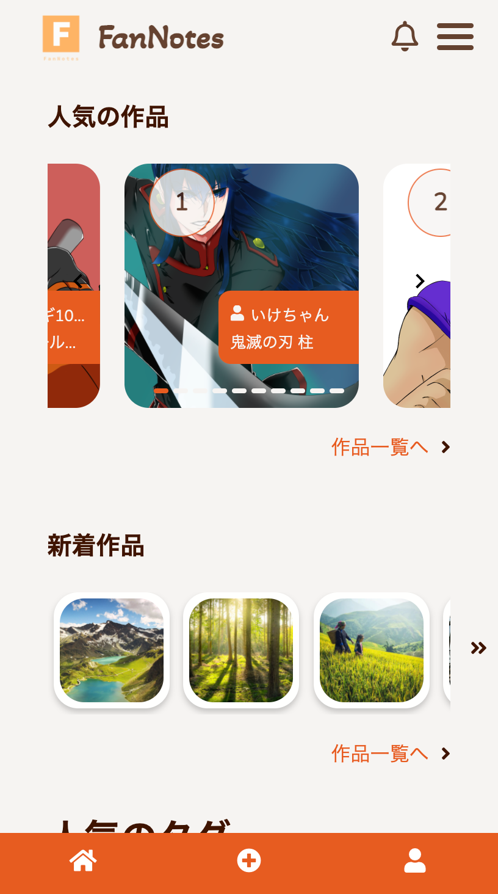
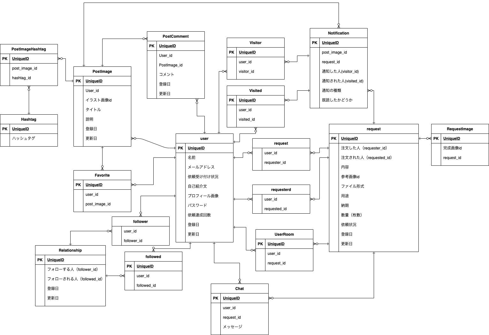

# FanNotes

## サイト概要

自分で描いたイラストやロゴ、写真などを投稿、閲覧できるサイトです。  
自分の好きなイラストを描く人、写真を撮る人を見つけて、オリジナルキャラクターやアイコン、HPの素材の作成依頼が可能です。 
自分のPF代わりに使用することも可能です。 
開発環境にはDockerを導入、テスト環境にはCircleCIを利用したpush時の自動テストを実装しています。 
バックエンドではRuby on Railsを使用、フロント部分はVue.jsを使用した、大部分をSPAとして作成しています。 
またスマートフォン表示にも対応しています。 
 
 
トップ画面(PC)

メイン画面(SP)

### サイトテーマ
自分の好きなイラストを描く人や、写真を撮る人に出会いもっと手軽で簡単に似顔絵や、オリジナルイラストの制作、HPの素材の写真などを依頼しよう！ 

### テーマを選んだ理由
実際に趣味でイラストを描いているのですが、インスタグラムのメッセージでこんな絵を描いて欲しいと依頼がきたことがありました。 
その時に、自分の絵を投稿できて、その絵を見てくれた人が手軽にイラストなどを描いて欲しいと依頼できるようなサービスはあまりないなと感じ、pixivとcoconalaが一緒になったようなサービスがあれば、便利だなと思いこのテーマを作成しました。 

### ターゲットユーザー
イラストが好きで実際に自分のアイコンなどを描いて欲しいやHPなどでの独自のイラストが欲しいユーザー  
自分のHPや、お店などで使用するロゴや、素材の写真をオリジナルなもので製作したいと思っているユーザー 
自分の絵や、写真を宣伝してもらうことで、自分の知名度を上げたいと考えているイラストを描いているユーザー

### 主な利用シーン
自分のアイコンを作成してもらいたいときや、オリジナルのキャラクターの作成、HPの素材などの作成の為使用 
自分のイラストや絵、アイコン、写真やロゴなどをたくさんの人と共有したい時に使用 
イラストが上手いのにあまり有名でないユーザーの宣伝目的での使用 

## URL

fannotevue.com

ゲストログインからメールアドレス、アカウントネームなしでのログインが可能です。

## 設計書
- ER図

 

## 開発環境/使用技術
- OS：macOS, Docker/Docker-compose
- 言語：HTML,CSS,SCSS,JavaScript(Vue.js),Ruby(Ruby on Rails),SQL
- バックエンドフレームワーク：Ruby on Rails ver.6.0.3
- フロントエンドフレームワーク：Vue.js ver.2.6.12
- デプロイ：AWS/Nginx/Puma
- テスト:RSpec/ CircleCi CI/CD
- IDE：VScode/ Cloud9

## 機能一覧
- ユーザー登録、ログイン機能(devise)
- 投稿機能
  - いいね機能
  - コメント機能
  - タグ機能
  - ハッシュタグ機能
- フォロー機能
- 検索機能
  - ランキング機能
  - 並び替え機能
- イラスト依頼機能
  - チャット機能
  - プレビュー機能
- 通知機能

## 使用追加gem
- repec(テスト)
  - factory_bot_rails(データの作成)
- devise(ログイン機能)
- dotenv-rails(環境変数)
- activestorage-validator(active storageのvalidate)
- rails-in18s(日本語)
- faker(サンプルデータ作成)
- pry-byebug(デバック)
- webpacker(Vue.jsの使用の為)

## 使用npm
- vue-mq(スマートフォン対応の為)
- vue-router(SPAの作成の為)
- vuejs-paginate(paginateの実装の為)
- axios(API開発の為)
- hooper(スライド画面の作成の為)
- body-scroll-lock(モーダル表示時のスクロール防止の為)

## 今後の開発予定
- 全体のテストの充実（現在は単体テスト、APIテストのみの為）
- お問い合わせ
- ユーザーの評価機能
- 依頼するユーザーによって金額が発生する仕様
- Vuexを使用したデータを一元管理し、ページごとのAPIを無くす仕様に変更
- ユーザー登録時Devise Token Authを使用し完全なSPA化 etc...

## 使用素材
- [hatchful(ロゴの制作)](https://hatchful.shopify.com/ja/onboarding/logo-usages)
- [Unsplash photo for everyone(画像の使用)](https://unsplash.com/)
- [unDraw(画像の使用)](https://undraw.co/)
- [fontawesome(アイコン)](https://fontawesome.com/)